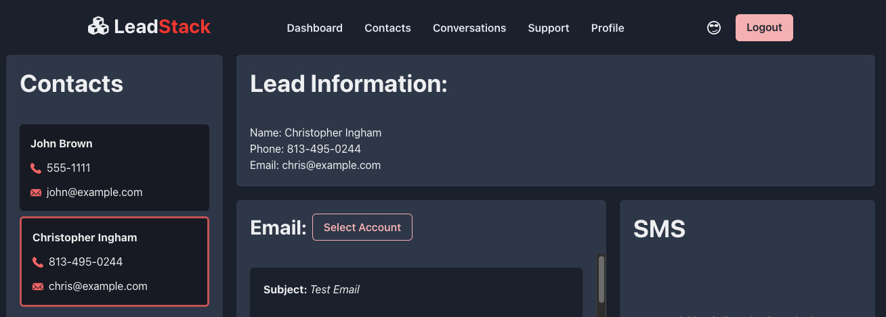

# LeadStack


## Description

Lead Source Integration with Twilio for Multiple Communication Channels.

The purpose of this project is to create a lead source integration with Twilio to provide multiple channels of communication to potential customers. The integration will allow users to choose their preferred line of communication, receive temporary communication lines and enable the sales group to view the customer's actual phone number/email.

__Tech. Stack:__

- Node.js
- Express
- MongoDB, Mongoose
- GraphQL, Apollo Server/Client
- JavaScript
- React
- Chakra React
- JWT
- bcrypt
- twilo
- nodemailer



## Table of Contents

-   [Installation](#installation)
-   [Usage](#usage)
-   [Credits](#credits)
-   [License](#license)
-   [Contribution](#contribution)
-   [Tests](#tests)

## Installation

Application is running on https://lead-stack.herokuapp.com/

Presentation of the project: [LeadStack Presentation](https://docs.google.com/presentation/d/1tkIDg6jGD2DLdkFFVc9-2TnJwtKiZI8imH4APC0xwfk/edit#slide=id.p)

Development:

- from the root run:

`npm install` to install module 'concurrently', requried to run dev. env. in one terminal window.

`npm run install` to install dependencies for client and server sides.

-   To start dev. environment in one terminal window, run from the root

```
npm run develop
```

-   To start client in dev mode. Navigate to root/client, run

```
npm run dev
```

-   To start server in dev mode. Navigate to root/server, run

```
npm run watch
```

-   To seed initial data (2 salesperson, 2 clients). Navigate to root, run

```
npm run seed
```

## Usage

- Open the application
- You need to sign up to use this application
- Make sure your phone number is 2765985134 (our Twilio number)
- Navigate to Contacts tab to create Clients
- To send an actual text message right now the only verified number in Twilio is 5083950012 
- Navigate to Conversations tab
- You will see the list of your Clients at the left side
- Select a client on the left to see email /sms cards
- Use email /sms section to contact your clients

## Credits

- __GitHub__: [isayahdurst](https://github.com/isayahdurst) __Email__: [isayah@fungeapp.com](mailto:isayah@fungeapp.com?subject=[GitHub]%20LeadStack%20Question) 
- __GitHub__: [lunchtimewhee](https://github.com/lunchtimewhee) __Email__: [anthonyrli1994@gmail.com](mailto:anthonyrli1994@gmail.com?subject=[GitHub]%20LeadStack%20Question) 
- __GitHub__: [frankmng](https://github.com/frankmng) __Email__: [frankmhnguyen@gmail.com](mailto:frankmhnguyen@gmail.com?subject=[GitHub]%20LeadStack%20Question)
- __GitHub__: [OlgaGav](https://github.com/OlgaGav) __Email__: [ogavby@gmail.com](mailto:ogavby@gmail.com?subject=[GitHub]%20LeadStack%20Question) 
- __GitHub__: [elangworth](https://github.com/elangworth) __Email__: [e24murph@gmail.com](mailto:e24murph@gmail.com?subject=[GitHub]%20LeadStack%20Question) 
- Learning materials [Berkley Extension: coding bootcamp](https://extension.berkeley.edu/)
- Instructor: [Robert Wijtman](https://www.linkedin.com/in/robbert-b-wijtman-3895121b/)


## License


This application is available under the license: MIT License.
See the LICENSE file for more info. Full details available by link https://choosealicense.com/licenses/mit/.


## Contribution

Contributions are what make the open source community such an amazing place to learn, inspire, and create. Any contributions you make are greatly appreciated. 

 - Fork the Project 
 - Create your Feature Branch 
 - Commit your Changes 
 - Push to the Branch 
 - Open a Pull Request

## Tests

n/a

## Link to Live Site

https://lead-stack.herokuapp.com/
